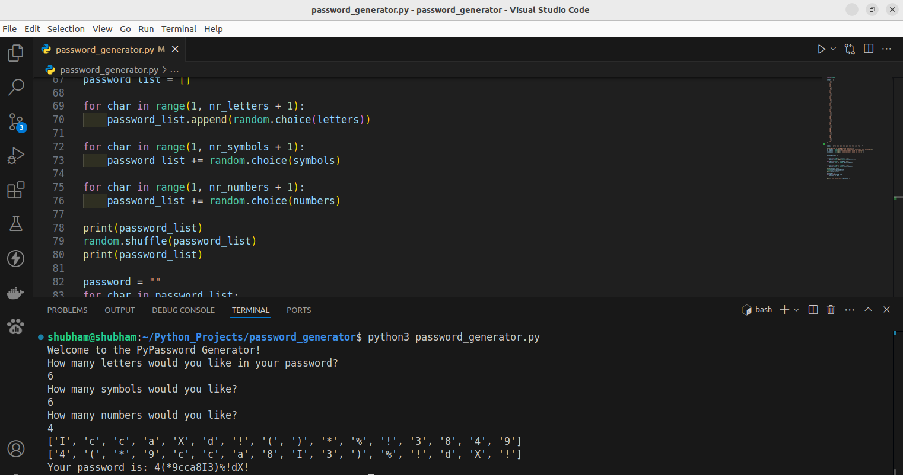

# Password Generator

## Screenshot

This project is a Password Generator built with [Python 3](https://www.python.org/downloads) that creates secure and random passwords based on user-defined criteria. The program allows users to specify the desired password length and whether to include lowercase letters, uppercase letters, numbers, and special characters. The generator then produces a strong, unpredictable password suitable for secure account protection. This project is a great way to practice Python skills like string manipulation, randomization, and working with user input.

## 📚 Library used:
+ [random](https://docs.python.org/3/library/random.html)
+ [python](https://www.python.org/downloads)
 
## 🌟 How to run the script:

+ `python3 password_generator.py`